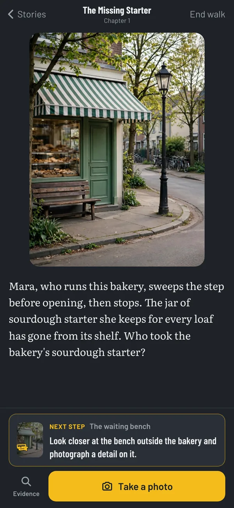
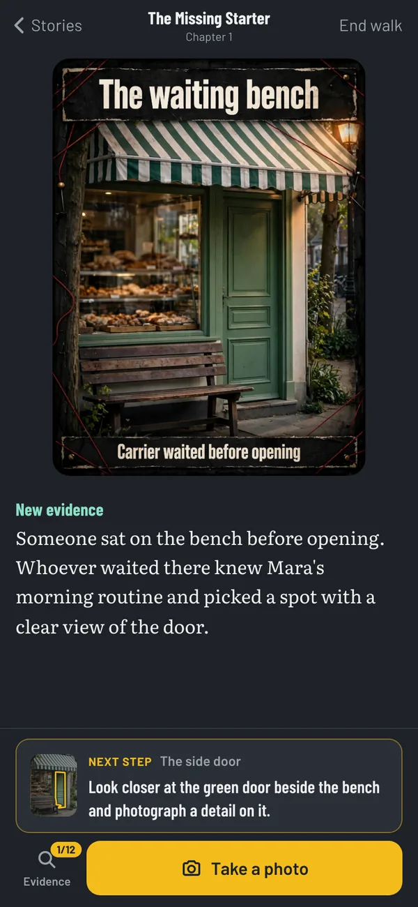
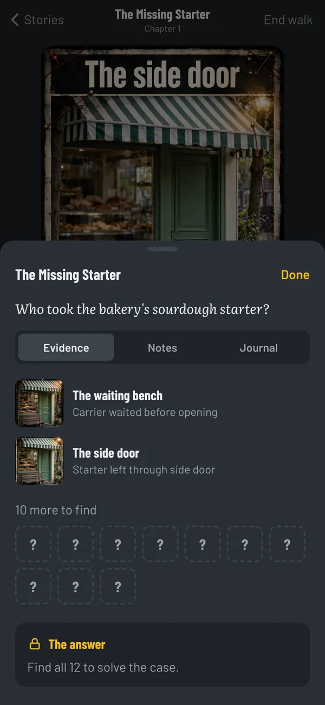

<div align="center">

# Questory

**Turn photos of your street into a story.**

Wren, an AI agent, builds a case from what you photograph. Every case is solved on foot.

Play at [questory.run](https://questory.run)

<p>
  
  
  
</p>

</div>

Questory is made for phones. Open [questory.run](https://questory.run) on your phone, or scan the code it shows on a computer. It was built on the Meta Model API for the Meta Global AI Developer Hackathon. Why it's played on foot, and with a friend, is on the [Impact page](https://questory.run/impact).

## How to play

A case is a question with a hidden answer, like where a bakery's sourdough starter went. You solve it by photographing what Wren asks for.

1. Pick a theme for the story, and how long you want to walk: 15 minutes, 30 minutes or an hour.
2. Take a photo of where you are. Wren writes the opening of the case around it, then leads you outside if you aren't already.
3. Follow the quests to find evidence. A quest asks for a closer look at something in your last photo, or sends you on to find something, with 5 minutes of walking counted down on screen before the next evidence can turn up. What you photograph on the way still goes into the story. A photo that moves the case forward becomes a piece of evidence.
4. Collect evidence until it points to the answer. A longer walk gets a longer case, with more chapters, sized so you can solve it before the walk is over. You can stop at any time, and your next photo picks the story up wherever you are.

To play with a friend, choose "With a friend" and send them the link. The case gets two leads, one for each of you: two trails of evidence that end at the same answer. You each follow yours on your own walk, at the same time or not, and a chapter ends once you have both finished your part.

## How it works

Wren is an AI agent. It plans each case, reads every photo with what it remembers of the story, writes what happens and sets the next quest. When your photos stop fitting its plan, it changes the plan. Wren can't walk, so you do, and its quests say where to look.

Questory is a Next.js 16 app. Wren runs on Muse Wonder and has three subagents, each another model from the Meta Model API with one job:

| Model | Role | What it does |
| :--- | :--- | :--- |
| Muse Wonder | Agent | Wren: plans the case, reads each photo, and writes the story and quests |
| Muse Spark | Subagent | Checks Wren's lines against the photo |
| SAM 3.1 | Subagent | Outlines what a closer-look quest points at |
| Muse Image | Subagent | Paints the evidence from the photo |

On a real game screen:


### What happens to each photo


1. You take a photo. The phone resizes it to 1280 px, re-encodes it as JPEG and uploads it.
2. Muse Wonder reads the photo with the story so far. In one structured JSON reply, Wren decides what the photo means, writes a few lines and gives the next quest if there is one. A photo can answer the current quest, take the story somewhere new, or be a side note that leaves the quest open.
3. Unless the photo was a side note, Muse Spark compares Wren's lines with the photo and removes anything described as visible that isn't there. At the same time, if the next quest is a closer look, SAM 3.1 finds its target in the photo and outlines it, so you know where to look.
4. The story memory is saved.
5. If the photo turned up evidence, Muse Image paints it from the photo.

### How Wren keeps a case together

Every case has one question and a hidden answer that Wren decides at the start. Wren plans each chapter as places and objects to find, and each quest goes where the last find pointed, so the evidence forms a trail.

Each photo becomes something it could reasonably be in the story. After two side notes in a row, the next photo that can count moves the story whatever it shows. If the evidence stops pointing to the answer, Wren changes the answer to fit everything found so far.

A case moves on foot, and fits in one walk. A 15-minute walk gets one chapter of three pieces of evidence, 30 minutes two such chapters, and an hour three chapters of four. When a quest sends you somewhere, its evidence can turn up only after 5 minutes of walking, counted down on screen (`WALK_TIMER=off` turns this off), and the story gives a reason the trail goes on. Each quest remembers what its photo showed, so Wren can tell whether the next photo was taken somewhere else. A photo sent on the way, or from the same place, is a side note. After a photo taken indoors, the next quest leads outside. A closer look counts where you stand, and Wren never gives two in a row. Time and the photos stand in for distance, so the game never needs your location.

Wren's memory of a case has three layers, saved after every photo:

| Layer | What it holds | How it changes |
| :--- | :--- | :--- |
| Skeleton | The hidden plan: the answer, what each chapter finds out, and the steps on each lead | Only when your photos no longer fit the plan |
| Bindings | Which real thing is which story element | Added or swapped with any photo |
| Canon | Facts already established in play | New facts are added, and old ones never change |

### Two players

A shared case has two leads that come at the answer from different sides, such as how it was done and who could have done it. Each player follows one lead without waiting for the other. Wren sees what both have found and mentions a partner's find when it changes what yours means. A chapter's ending is written from everything both players found. Each photo is saved under a short per-story lock, so two photos sent at once both count. If your friend hasn't joined by the time your part is done, you can play their lead too.

## Privacy

- There is no account. A random ID in a cookie links your stories to your browser.
- The app never asks for your location. Photos are re-encoded on the phone before upload, which removes their location data, and walk times come from when photos were sent.
- Photos go to the Meta Model API, and Meta may use what it receives to improve its products. They are then stored in an encrypted private bucket, served only through unguessable links.
- An invite link shows only its own case, and a case has room for one friend, so a forwarded link can't let a third person in.
- Deleting a story also deletes its photos and evidence cards.

## Run it locally

You need Node.js 22 or 24.

```sh
npm install
cp .env.example .env.local   # add MODEL_API_KEY to use the real models
npm run dev
```

Open http://localhost:3000. Without `MODEL_API_KEY`, Wren reads from a script, so you can work on the interface without spending credit. Without the Appwrite settings, it saves stories as files in `.data/`. `GET /api/health` shows which mode, models and storage are in use. The other settings, such as the daily call limits, are documented in [`.env.example`](.env.example).

To try it on a phone on the same Wi-Fi, open the Network address that `npm run dev` prints and scan the code it shows. Anyone on that network can reach the server, so stop it when you're done if a real key is set.

Run the unit tests with `npm test`.

## Deployment

The live game at [questory.run](https://questory.run) runs on [Vercel](https://vercel.com), and every merge to `main` deploys it. Stories, photos and evidence cards are stored in [Appwrite](https://appwrite.io).

## Project structure

```
app/page.tsx        Landing page, with a code to scan on a computer
app/how-it-works/   How Wren and its subagents turn photos into a case
app/impact/         Why it's played on foot, and with a friend
app/privacy/        What happens to photos and stories
app/play/           The game
app/api/            Route handlers for stories, turns, evidence cards, media and health
components/         The mobile interface
lib/gm/             Wren, the agent: state, prompts, output schemas, engine and a scripted mock
lib/meta/           Meta Model API clients for structured JSON, SAM 3.1 and Muse Image
lib/store/          Storage in local files or Appwrite
lib/client/         Browser code for photos, API calls and invite links
scripts/            Appwrite setup
```

## License

Questory is released under the [MIT License](LICENSE). The Barlow and Literata fonts are under the SIL Open Font License (see `app/fonts/`).
